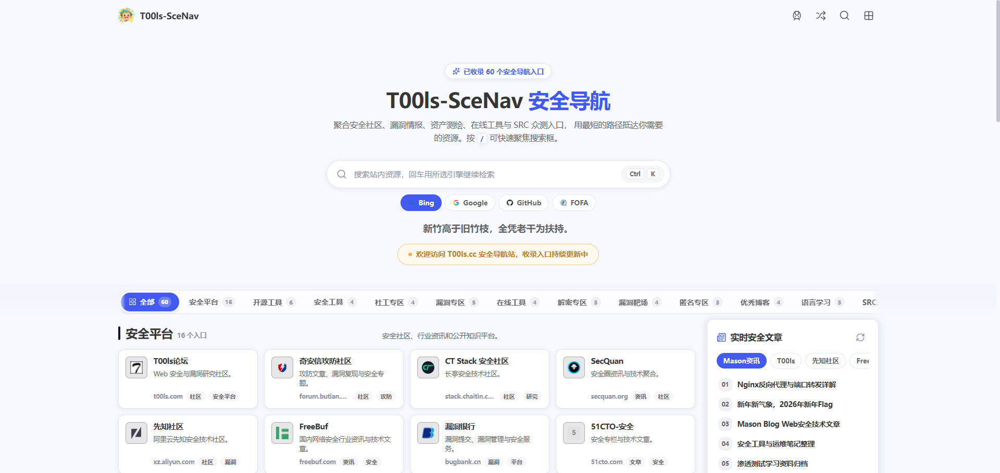
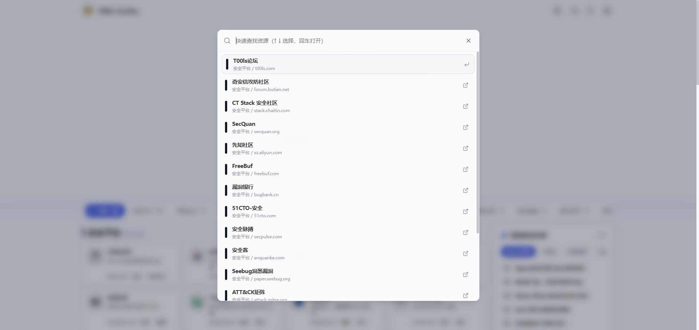

# SECNav · T00ls-SceNav 安全导航


> 面向安全从业者的一站式导航首页：把安全社区、漏洞情报、资产测绘、在线工具、SRC 众测和实时安全文章收进同一页，用最短路径抵达需要的资源。

## 项目简介

SECNav 是一个纯前端的静态导航站，使用 Vue 3 组合式 API 与 Vite 构建，无后端、无数据库、无运行时依赖，构建产物直接丢到任意静态托管即可上线。

页面围绕「打开即用」设计：顶部是聚合搜索框，向下是吸顶分类栏与资源卡片网格，侧栏提供实时安全文章与作者信息。所有链接、分类、标签都集中在 `src/data/navigation.js` 一个文件里，维护导航入口只需要改一处。

## 功能亮点

- **60+ 精选入口 / 12 个分类**：安全平台、开源工具、安全工具、社工专区、漏洞专区、在线工具、解密专区、漏洞靶场、匿名专区、优秀博客、语言学习、SRC 众测。
- **双重检索**：输入关键词即时过滤站内资源；回车可用所选引擎继续外部检索，支持 Bing、Google、GitHub 与 FOFA（自动 base64 编码查询语句）。
- **命令面板**：`Ctrl / ⌘ + K` 唤起快捷面板，`↑` `↓` 选择、回车打开，按 `/` 可直接聚焦搜索框。
- **本地收藏**：资源一键收藏，收藏结果通过 `localStorage` 保存在浏览器本地，收藏分类会置顶显示。
- **实时安全文章**：侧栏解析 RSS / Atom 源（Mason 资讯、T00ls、先知社区、FreeBuf、奇安信攻防社区），支持手动刷新，网络不可用时自动回退到内置列表。
- **滚动体验**：分类导航吸顶、滚动自动高亮、平滑定位、回到顶部环形进度、随机打开一个入口。
- **本地图标**：`scripts/fetch-resource-icons.mjs` 抓取各站点自身 favicon 存放在 `public/icons/`，运行时不依赖任何第三方图标服务；新增入口后重跑脚本即可。
- **响应式与可访问性**：覆盖 1440 / 1180 / 900 / 768 / 640 / 480 六档断点，语义化标签、ARIA 属性与 `prefers-reduced-motion` 适配。
### 界面预览




## 收录内容

| 分类 | 数量 | 内容概述 |
| --- | ---: | --- |
| 安全平台 | 16 | 安全社区、攻防文章与行业资讯 |
| 开源工具 | 6 | CyberChef、FOFA、Shodan、VirusTotal 等 |
| 安全工具 | 4 | 自动化扫描框架、字典与 Payload 集合 |
| 社工专区 | 4 | 泄露查询、邮箱发现、历史归档与 ASN 情报 |
| 漏洞专区 | 5 | CVE / NVD / Exploit-DB 等漏洞库与 PoC |
| 在线工具 | 4 | 正则调试、JWT 解析、DNS 与 URL 沙箱 |
| 解密专区 | 3 | 哈希查询、口令破解与逆向工具 |
| 漏洞靶场 | 4 | PortSwigger Academy、HTB、TryHackMe、CTFtime |
| 匿名专区 | 3 | Tor、Tails 与隐私保护方案 |
| 优秀博客 | 4 | HackTricks、DFIR Report 等技术博客 |
| 语言学习 | 3 | MDN、Python 与 Go 官方文档 |
| SRC 众测 | 4 | 补天、漏洞盒子、HackerOne、Bugcrowd |

## 技术栈

| 层面 | 选型 |
| --- | --- |
| 框架 | Vue 3.5（`<script setup>` 组合式 API） |
| 构建 | Vite 8 |
| 图标 | @lucide/vue + 本地抓取的站点 favicon |
| 样式 | 原生 CSS，设计令牌变量 + 玻璃拟态、无 UI 框架 |
| 数据 | 静态 JS 模块，RSS 由浏览器端 `DOMParser` 解析 |

## 快速开始

需要 Node.js `^20.19.0 || >=22.12.0`（Vite 8 要求）。

```bash
npm install

npm run dev       # 启动开发服务器 http://localhost:5173
npm run build     # 构建到 dist/
npm run preview   # 预览构建产物
npm run icons     # 抓取/更新站点图标（加 --force 强制重抓）
```

Windows 下也可以直接双击 `run-dev.cmd` 启动开发服务器。

## 目录结构

```
.
├─ index.html                        # 入口 HTML，站点标题与描述
├─ vite.config.js                    # Vite 配置（端口 5173）
├─ run-dev.cmd                       # Windows 一键启动脚本
├─ scripts/
│  └─ fetch-resource-icons.mjs       # 抓取 favicon 并生成图标映射
├─ public/
│  ├─ logo.webp                      # 站点图标
│  └─ icons/                         # 各导航站点本地图标
└─ src/
   ├─ main.js                        # 应用入口
   ├─ App.vue                        # 布局、搜索、收藏与滚动逻辑
   ├─ components/                    # 搜索框、侧边分类、资源卡片、命令面板、文章面板等
   ├─ data/
   │  ├─ navigation.js               # 分类、资源、搜索引擎、资讯源（维护主入口）
   │  └─ resourceIcons.js            # 图标映射（脚本生成，勿手改）
   ├─ utils/                         # 颜色等工具函数
   └─ styles/main.css                # 全站样式与响应式断点
```

## 新增一个导航入口

编辑 `src/data/navigation.js`，在对应分类的 `resources` 数组里追加一行即可，卡片、搜索、命令面板和分类计数会自动更新：

```js
resource(
  '站点名称',            // 标题
  'https://example.com/', // 跳转地址
  'example.com',          // 域名
  '一句话描述',            // 卡片描述
  ['标签一', '标签二'],    // 用于搜索与展示的标签
  'Short',                // 无图标时显示的角标文字
)
```

新增后运行 `npm run icons`，即可把该站点图标下载到本地并写入 `src/data/resourceIcons.js`。

## 部署

`npm run build` 生成的 `dist/` 是纯静态文件，可直接部署到 Nginx、Vercel、Netlify、Cloudflare Pages 或 GitHub Pages。

当前 `vite.config.js` 未设置 `base`，默认按根路径部署。若要发布到 GitHub Pages 的子路径（例如 `https://<user>.github.io/SECNav/`），需要显式指定：

```js
export default defineConfig({
  base: '/SECNav/',
  plugins: [vue()],
})
```

## 说明

- 本项目仅收录公开站点的导航索引，链接内容与可用性归各站点所有，不代表对第三方内容的认可。
- 请遵守所在地法律法规以及目标站点的使用条款，仅将本项目用于合法用途。
- 仓库当前未附带开源许可证，默认保留所有权利；如需二次分发或商用，请先与作者联系。

## 作者

- 博客/主站：[HelloMason](https://www.memme.cn/)
- GitHub：[Mario-Call](https://github.com/Mario-Call)
- 邮箱：admin@memme.cn

Copyright © 2026 By Mason
